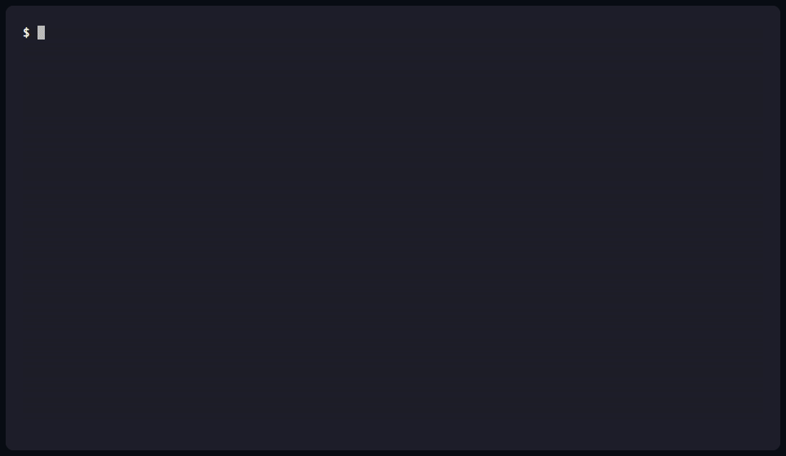

# AgentGuard

[](https://github.com/nikegunn/agentguard/releases)
[](https://github.com/nikegunn/agentguard/actions/workflows/ci.yml)
[](LICENSE)
[](https://goreportcard.com/report/github.com/nikegunn/agentguard)
[](https://docs.sigstore.dev/cosign/overview/)
[](https://nikegunn.github.io/agentguard/)

> Zero-trust security sidecar for AI agents — Claude Code, Cursor, Codex,
> Gemini CLI, Windsurf, or anything that speaks MCP.

AgentGuard sits transparently between your AI agent and the tools it
calls. Every JSON-RPC frame goes through a five-stage inspection
pipeline that catches **prompt injection**, **tool poisoning**, **rug
pulls**, **runaway loops**, and **credential exfiltration** before they
reach your model — or your customers' data.

```bash
curl -fsSL https://agentguard.dev/install | sh
agentguard init        # detects + patches every installed agent
agentguard dashboard   # opens http://127.0.0.1:7878
```

That's it. The next tool call your agent makes is now inspected.



> Demo not rendered yet? Run `vhs demo/agentguard.tape` from the repo
> root — see [`demo/README.md`](demo/README.md) for the one-time setup.

## Why

LLM agents trust their tools by default. A poisoned MCP server can rewrite
its tool descriptions between sessions, embed prompt injections in
responses, or quietly funnel your credentials to a webhook. Your IDE's
approval prompt won't catch any of that — it just shows the human-readable
intent. AgentGuard inspects the wire.

## What you get

- **Single Go binary**. No daemon, no Docker, no kernel modules.
- **Local-only**. No account, no telemetry, no cloud. Your data stays on
  your machine.
- **<5 ms p99** overhead on the cheap inspection path (measured, enforced
  by CI gate).
- **Auto-detect + auto-wire** for Claude Code, Cursor, Codex CLI, Gemini
  CLI, Windsurf. Backups are byte-identical; uninstall restores them
  exactly.
- **Live TUI** (`agentguard tail`) and a polished web dashboard with SSE
  live updates and dark + light themes.
- **Replay** historic traffic against new rule packs before rolling them
  out.
- **MIT licensed**. Releases are cosign-signed via GitHub OIDC.

## How it works

```
agent  ─▶  agentguard wrap  ─▶  MCP server
       ◀                    ◀
       │
       └─ five inspection stages:
          transport · schema · attestation · policy · scanner · ML
          plus a per-session circuit breaker
```

`agentguard init` rewrites every MCP entry in each agent's config so the
agent spawns `agentguard wrap -- <original command>` instead of the
upstream server directly. The agent doesn't notice. The server doesn't
notice. The inspection happens in the middle.

[Full architecture →](docs/src/architecture.md)
[Threat model →](docs/src/threat-model.md)

## Commands

| Command                      | What                                              |
|------------------------------|---------------------------------------------------|
| `agentguard init`            | Detect agents, patch their configs.               |
| `agentguard dashboard`       | Local web UI at `127.0.0.1:7878`.                 |
| `agentguard tail`            | Live TUI of tool calls.                           |
| `agentguard scan <cmd>`      | Fire the attack corpus at an MCP server.          |
| `agentguard doctor`          | Homebrew-style health check.                      |
| `agentguard replay`          | Re-run the pipeline against historic traffic.     |
| `agentguard pack list/show/verify` | Manage rule packs.                          |
| `agentguard uninstall`       | Restore every config byte-for-byte.               |

## Status

Feature-complete for v1 launch (M5 done). Polish + signing pipeline
landed in M6. See [CHANGELOG.md](CHANGELOG.md) for the full milestone
log.

## Contributing

Issues and PRs welcome. We're particularly interested in:

- New rule packs for popular MCP servers
- More agent detectors (Aider, Cline, Continue, etc.)
- Additional prompt-injection corpora

See [CONTRIBUTING.md](CONTRIBUTING.md).

## License

MIT. See [LICENSE](LICENSE).

## Sponsors

AgentGuard is built and maintained for free. If your team depends on it,
[sponsor the project →](https://github.com/sponsors/nikegunn) (Bronze /
Silver / Gold tiers).
